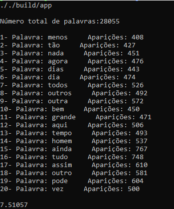

# Word Recurrence: Top K Elements
AEDS II | CEFET-MG

<div style="display: inline-block;">    
 
 
</a> 
</div>

<p> </p>
<p> </p>

# Introdução
<p align="justify">
 Um exemplo clássico de problema que pode ser solucionado utilizando-se hash e heap é o chamado top k itens. Neste problema, é preciso encontrar os k itens mais valiosos de uma coleção de dados. Logo, utiliza-se o hash para contar a frequência de todos os itens, enquanto o heap se aplica na manutenção de uma lista dos k itens de maior valor.

 O programa ira ler dois arquivos, cada um contento um texto sem nenhuma formatação. Cada parágrafo é separado por pelo menos por uma linha em branco. Ao decorrer no texto existem palavras que nao possuem conteudo semantico, como artigos e conjunções denominadas "stop words". A lista de "stop words" foi fornecida atraves de um arquivo criado por nós.


 Além das stop words, é necessário retirar pontos e entre outros caracteres que não serão considerados como palavras para realizar montagem da Hash de palavras.

 |          Sinais de pontuação  | Stop words                                      |
 |-------------------------------|-------------------------------------------------|
 | `.`,   `!`,   `?`             |   `artigos(a, o, as,os) ou conjunções(e, ou) `  |

 Sendo assim, a intenção é ler os dois arquivos, jogar todas as palavras de ambos os arquivos juntos em uma hash, e apartir de uma heap, demonstrar no terminal quais as K plavras com mais aparições dentro da Hash. Não é necessário que apareçam orndenadas.

 > Como saída, o programa irá gerar no terminal as K palavras, desordenadas, e com sua respecivas quantidades de ocorrência.

# Arquivos                                                     
<p align="justify">

 O projeto é dividido entre três arquivos de códigos própriamente ditos: `leitura.hpp`, `leitura.cpp` e `main.cpp`.

 |  Arquivo                        |   Função                                                                                          |
 | ------------------------------- | ------------------------------------------------------------------------------------------------- |
 |  `main.c`                       | Arquivo principal para iniciar e chamar as funções do código                                      |
 |  `leitura.hpp`                  | Define as funções e as estruturas que foram utilizadas no código                                  |
 |  `leitura.cpp`                  | Contém o escopo de todas as funções que foram utilizadas                                          |
 | `stopwords.txt`                 | arquivo que contem as stop words                                                                  |
 | `arquivo de leitura .txt`       | arquivo de entrada principal no qual será feita toda a análise                                    |

# Funções 
 - `readPrincipal()` - [linhas 3 a 103] - função principal em que são lidos os arquivos, definidas as variáveis e chamadas todas as outras funções;
 - `insereHash()` - [linhas 105 a 119] -  insere uma nova palavra na hash, ou caso ja exista, incrementa o contador de quantidade de aparições tanto de palavras totais quanto de recorrência de uma palavra;
 - `readStopWords` - [linhas 121 a 141] -  lê o arquivo de texto que contém as stopwords e as armazena em uma outra Hash auxiliar; 
 - `preencheMapPontos()` - [linhas 143 a 169] -  preenche uma Hash auxiliar com os pontos que serão removidos;
 - `isPonto()` - [linhas 171 a 176] -  recebe um char e ve se ele eh um ponto a partir da procura do map de pontos, única função que não é chamada na principal, e sim na `removePontuacao()`;
 - `removePontuacao()` - [linhas 178 a 187] -  que remove todos os demais sinais de pontução que não delimitavam sentenças; 
 - `tiraReticencia()` - [linhas 189 a 207] -  para retirar as reticências presentes;
 - `temNumero()` - [linhas 209 a 217] -  remove os números da linha para não considerá-los como palavras;
 - `Pontuacao()` - [linhas 219 a 247] -  que é utilizada para delimitar sentenças e remover pontos especificos; 
 - `converterAcentuadasParaMinusculas()` - [linhas 249 a 259] - converte as letras acentuadas para minúscula;
 - `heap()` - [linhas 251 a 296] -  onde é implementada a lógica de heap para encontrar os K elementos na hash com mais ocorrências;
 - `Remove_Caracter_Fora_ASCII()` - [linhas 298 a 315] -  remove alguns caracteres especificos que não estão presentes na tabela ASCII;

# Lógica Implementada
<p align="justify">

 O arquivo principal, `main.cpp`, inicializa o tempo de execução, chama a função `readPrincipal()` e marca o tempo ao fim do programa, respectivamente. A função citada é a responsável por todo o funcionamento do código propriamente dito. Definida no `leitura.hpp` e trabalhada no `leitura.cpp`, ela é a que processa todas as demais funções presentes no projeto.

 ### Estruturas utilizadas
 
 Na função `readPrincipal()` a primeira coias a ser feita é a declaração da principal estrutura de dados utilizada no algoritmno, no caso a estrutrura `unordered_map`. Essa estrura vai armazenar todas as infomações para ser jogada na Heap posteriormente. Para a contrução da Heap foi utilizada a função `make_heap()` presente na biblioteca stl do C++. 

 Para entender como a logica foi construida, é necessario entender como essas estruturas de dados funcionam:

 ### Unordered_map
 O `unordered_map` é um contêiner associativo que armazenam elementos formados pela combinação de um valor-chave e um valor mapeado , e que permitem a recuperação rápida de elementos individuais com base em suas chaves. Em um unordered_map , o valor da chave geralmente é usado para identificar exclusivamente o elemento, enquanto o valor mapeado é um objeto com o conteúdo associado a esta chave . Os tipos de chave e valor mapeado podem ser diferentes. Internamente, os elementos no unordered_map não são classificados em nenhuma ordem específica em relação à sua chave ou valor mapeado, mas organizados em intervalos dependendo de seus valores de hash para permitir acesso rápido a elementos individuais diretamente por seus valores-chave (com uma complexidade de tempo média constante em média).

 Propriedades do contêiner:

 - Associativo: os elementos em contêineres associativos são referenciados por sua chave e não por sua posição absoluta no contêiner.
 - Não ordenado: os contêineres não ordenados organizam seus elementos usando tabelas hash que permitem acesso rápido aos elementos por sua chave.
 - Mapa: cada elemento associa uma chave a um valor mapeado : As chaves têm como objetivo identificar os elementos cujo conteúdo principal é o valor mapeado.
 - Chaves exclusivas: dois elementos no contêiner não podem ter chaves equivalentes.
 - Consciente do alocador: o contêiner usa um objeto alocador para lidar dinamicamente com suas necessidades de armazenamento.

 Inicialização de uma variável `unordered_map` utilizada no código:

 ```
 unordered_map<string, int> Hash;
 ```

 Iteradores para elementos de contêineres unordered_map acessam a chave e o valor mapeado. Para isso, a classe define o que é chamado de value_type , que é uma classe par com seu primeiro valor correspondente à versão const do tipo de chave (parâmetro de template Key) e seu segundo valor correspondente ao valor mapeado (parâmetro de modelo T):

 ```
    typedef pair<const Key, T> value_type;
 ```
 Iteradores de um contêiner unordered_map apontam para elementos deste value_type . Assim, para um iterador chamado que aponta para um elemento de um mapa , sua chave e valor mapeado podem ser acessados ​​respectivamente com:

 ```
    1 unordered_map<Key,T>::iterator it;
    2 (*it).first;             // the key value (of type Key)
    3 (*it).second;            // the mapped value (of type T)
    4 (*it);                   // the "element value" (of type pair<const Key,T>) 
 ```

 Naturalmente, qualquer outro operador de acesso direto, como -> ou [] pode ser utilizado, por exemplo:

 ```
    1 it->first;               // same as (*it).first   (the key value)
    2 it->second;              // same as (*it).second  (the mapped value) 
 ```

 ### Make_heap
 A `make_heap()` reorganiza os elementos no intervalo (<i>first<i>, <i>last<i>) de forma que formem uma pilha. A heap é uma forma de organizar os elementos de um intervalo que permite a recuperação rápida do elemento com o valor mais alto a qualquer momento (com pop_heap), mesmo repetidamente, ao mesmo tempo que permite a inserção rápida de novos elementos (com push_heap). No caso da `make_heap()`, o elemento com maior valor é sempre apontado primeiro. A ordem dos outros elementos depende da implementação específica. Os elementos são comparados usando operador <i><<i>, o elemento com o valor mais alto é um elemento para o qual retornaria falso quando comparado a todos os outros elementos do intervalo.

 Exemplo de implementação básica:

 ```
    // range heap example
    #include <iostream>     // std::cout
    #include <algorithm>    // std::make_heap, std::pop_heap, std::push_heap, std::sort_heap
    #include <vector>       // std::vector

    int main () {
    int myints[] = {10,20,30,5,15};
    std::vector<int> v(myints,myints+5);

    std::make_heap (v.begin(),v.end());
    std::cout << "initial max heap   : " << v.front() << '\n';

    std::pop_heap (v.begin(),v.end()); v.pop_back();
    std::cout << "max heap after pop : " << v.front() << '\n';

    v.push_back(99); std::push_heap (v.begin(),v.end());
    std::cout << "max heap after push: " << v.front() << '\n';

    std::sort_heap (v.begin(),v.end());

    std::cout << "final sorted range :";
    for (unsigned i=0; i<v.size(); i++)
        std::cout << ' ' << v[i];

    std::cout << '\n';

    return 0;
    }
 ```

 Saída:
 ``` 
    initial max heap   : 30
    max heap after pop : 20
    max heap after push: 99
    final sorted range : 5 10 15 20 99
 ```

 Sua complexidade é até linear em três vezes a distância(N) entre o primeiro e o último: compara os elementos e potencialmente os troca (ou move) até serem reorganizados como um heap, logo, temos ela como O(3n);

 >Como no trabalho foi especificado que não era necessário a ordenação da heap, a função `sort_heap` não chegou a ser utilizada. 

 ### Funcionamento da função readPrincipal()
 A função se inicia com a inicialização de um vector de strings para armazenar o nome dos arquivos de textos que serão lidos. Em seguida é definida as váriaveis, inclusive as utilizadas como Hash. Foram utilizadas 3 Hash: a `unordered_map<string, int> Hash` que é a Hash principal onde serão armazenadas todas as palavras, `unordered_map<string, bool>stopWords;` que é utilizada para guardar as stopwords que não devem ser consideradas para a hash principal, e `unordered_map<char, bool>pontos` que é utilizada para salvar os ponto que serão também desconsiderados na hash principal. Em seguida são chamadas as funções `preencheMapPontos()` e `readStopWords`.

 Um <i>for</i> que vai até o tamanho do vector de strings é utilizada para ler os arquivos de texto para preencher a hash principal. Em seguida temos um loop utilizando <i>while</i> que  repete enquanto não chegar no final do arquivo de entrada inserido e após contém outro <i>while</i> que vai ler até encontrar o fim da linha, determinado pelo <i>\n</i>. 

 Seguido de um outro <i>for</i> que irá pegar cada caracter da linha lida separadamente e o converterá em minusculo com a função `tolower()`, que converte o valor da letra caso esteja como uma valor maiúsculo da tabela ASCII para seu valor minúsculo. Fechado o <i>for</i>, são chamadas as funções `converterAcentuadasParaMinusculas()`, pois a função `tolower()` não consegue as converter caso estejam com algum sinal de acentuação, e `tiraReticencia()` para retirar qualquer que apareça na linha. Depois é realizada a tokenização da linha com o <i>istringstream</i>.

 Então temos uma condição para quando o caracter tokenizado não for um espaço em branco, em seguida um outro loop utilizando um <i>while</i> que irá palavra  por palavra até o final da linha em que se encontra. Dentro desse loop começamos com uma condição onde é chamada a função `temNumero()`, em que se é um número, não é adicionado na Hash, mas se não for um número entrara no <i>if</i>. Dentro dessa condição são chamadas as funções `Pontuacao()` e `removePontuacao()`, para retirar todos os sinais de pontuçãop para não ser inserido na hash. 

 Então, é utilizada um find, para averiguar se a palavra do momento é um stopword, então temos outra condição de caso a o iterador não tenha encontrado a palavra e seja igual ao fim da Hash de stopwords. E logo em seguida temos outra condição, se a palavra for diferente de um espaço em branco ou diferente dos outros caracteres estranhos, ela é adicionada a Hash principal a partir da função `insereHash()`. Então é dado um clean no token, e assim sucetivmente até o fim de dos arquivos. 

 Assim que é terminado o loop de leitura dos arquivos, é colocado na tela o número total de palavras encontrado e é chamada a função `heap()`. 

 ### Função heap()
 Dentro da função `heap()` é criado um <i>vector</i> dos mesmos tipos da hash a partir do <i>pair</i>. Então pego o inicio da Hash principal e dentro de um for, é passado os 20 primeiros elementos da Hash principal para o <i>vector</i>. Então com a função `make_heap()`, eu trasformo esse <i>vector</i> de 20 posições em uma Max Heap, ou seja, o primeiro elemento (raiz) será o maior.

 Então eu inicio um loop que irá até o fim da nossa Hash principal, e lá dentro temos uma condição em que, se as ocorrências da palavra atual são maiores que a da raiz da heap, então eu troco a raiz com o filho mais a esquerda da heap com a função `pop.heap()`, elimino a palavra da heap com um `pop.back()`, adiciono a nova palavra no fim com um `push_back`, e por fim utilizo novamente a função `make_heap()` para refazer a heap agora com o novo elemento adicionado. E dessa forma, até o fim da nossa Hash teremos todos os elementos com maiores valores de ocorrências. Por fim, é utilizado um for para plotar no terminal os 20 elementos. 

 <p> </p>

 ### Observação
 > É possível obter qualquer K valor dos itens, paenas mudando os valores <i>20</i> que estão presentes dentro da função `heap()` para o valor desejado. 

# Exemplo de Sáida
<p align="justify">

 |          Arquivos                     |
 |---------------------------------------|
 | `DomCasmurro.txt`                     |
 | `Semana_Machado_Assis.txt`            |
 

 | Total de Palavras em ambos os textos  |
 |---------------------------------------|
 | `28055`                               |

 A saída deve aparecer o número total de palavras encontradas, os K elementos com a sua chave string e seu número de ocorrêncais e o tempo final de execução em milissegundos como demonstrado na figura a seguir:  

 <p align="center">
 
 </p>

<p> </p>

<p> </p>

# Conclusão
 
 O trabalho proposto é de uma implementação que aborda o problema clássico de encontrar os K elementos mais recorrentes em uma coleção de dados de texto. A partir da realização do projeto, foi possível absorver uma compreenssão sólida sobre as estruturas de dados utilizadas, no caso do uso de hash com o `unordered_map` e de heap atráves da ja especificada `make_heap`. É possível afirmar que, utilizando da `make_heap` o programa há de ficar relativamente mais lento em sua compilaçao, levando em consideração o seu custo em comparação a implementação bruta de uma heap citada em literaturas.

 Complexidades:

 |    Estrutura                          |          Complexidade                 |
 |---------------------------------------|---------------------------------------|
 |   unordered_map(pesquisa)             |          O(1)                         |
 |        make_heap()                    |          O(3N)                        |
 |     heap(literatura)                  |          O(nlog(n))                   |

<p> </p>

<p> </p>

# Especificações do Dispositivo utilizado
<p align="justify">

 |                                                                                                                            |
 | -------------------------------------------------------------------------------------------------------------------------- |
 |  `Processador`         -> Intel(R) Core(TM) i7-8565U CPU @ 1.80GHz   1.99 GHz                                              |
 |  `RAM Instalada`       -> 16.0 GB (utilizável: 15.8 GB)                                                                    |
 |  `Tipo de Sistema`     -> Sistema operacional de 64 bits, processador baseado em x64                                       |
 |  `Sistema Operacional` -> Edição Windows 10 Home Single Language, versão 21H2                                              |


<p> </p>

<p> </p>


# Compilação e Execução
<p align="justify">

 Esse pequeno exemplo possui um arquivo Makefile que realiza todo o procedimento de compilação e execução. Para tanto, temos as seguintes diretrizes de execução:


 | Comando                |  Função                                                                                           |
 | -----------------------| ------------------------------------------------------------------------------------------------- |
 |  `make clean`          | Apaga a última compilação realizada contida na pasta build                                        |
 |  `make`                | Executa a compilação do programa utilizando o gcc, e o resultado vai para a pasta build           |
 |  `make run`            | Executa o programa da pasta build após a realização da compilação                                 |

<p> </p>

# Contatos

 <div style="display: inline-block;">
 <a href="https://t.me/jmarconia">
  
 </a>
 
 <a href="https://www.linkedin.com/in/jmarconi-almeida/">
 
 </a>

 </div>

 <p> </p>

 <a style="color:black" href="mailto:jmarconiadm@outlook.com?subject=[GitHub]%20Source%20Dynamic%20Lists">
 ✉️ <i>jmarconiadm@outlook.com</i> 
 </a>
